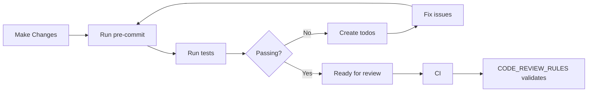

# agentic-repo

A CLI tool that transforms standard Git repositories into **Hybrid Human/Agent Environments**, optimizing for AI context windows, reduced hallucinations, and strict code governance.

## The Problem

AI agents cannot efficiently ingest an entire repository's context without:
- Wasting tokens on irrelevant files
- Getting confused by inconsistent patterns
- Hallucinating commands or configurations

## The Solution

**Context Routing** — The agent loads a lightweight "Router" file (`AGENTS.md`) first, which points to specific context files on demand.

## Quick Start

```bash
# Install
go install github.com/Shaked/agentic-repo/cmd/agentic-repo@latest

# Initialize your repository
cd your-project
agentic-repo init

# Preview what would be generated
agentic-repo init --dry-run
```

## What Gets Generated

```
your-project/
├── AGENTS.md                 # Router + workflow (<100 tokens)
├── CODE_REVIEW_RULES.md      # CI code review requirements
├── repo-best-practices.md    # Team patterns (editable)
├── USAGE.md                  # Human-readable guide
├── Makefile                  # Standard targets
├── .agentignore              # Files to skip
├── .pre-commit-config.yaml   # Enforcement hooks
├── .agent/
│   ├── stack.md              # Tech stack & versions
│   ├── testing.md            # Testing patterns
│   ├── commands.md           # CLI cheat sheet
│   └── AGENTS_LEGACY.md      # Migrated original (if existed)
├── .cursorrules              # Cursor AI integration
└── .claude/
    └── settings.json         # Claude integration
```

## Supported Stacks

| Language | Package Manager | Linter | Formatter | Testing |
|----------|----------------|--------|-----------|---------|
| **Go** | go mod | golangci-lint | gofmt | go test |
| **Python** | uv | ruff | ruff | pytest |
| **Node/TS** | pnpm | eslint | prettier | vitest |
| **Java** | Maven | Checkstyle | Spotless | JUnit 5 |

## Monorepo Support

The tool auto-detects monorepos and creates hierarchical context:

```
monorepo/
├── AGENTS.md              # Root router
├── backend/
│   ├── AGENTS.md          # Python context
│   └── .agent/
├── frontend/
│   ├── AGENTS.md          # TypeScript context
│   └── .agent/
└── services/api/
    ├── AGENTS.md          # Go context
    └── .agent/
```

## The Agent Workflow

Agents follow an iterative development loop that ensures quality and self-correction:



### Context Loading

1. **Agent reads `AGENTS.md`** — Gets the map and workflow instructions
2. **Agent loads context on demand:**
   - Bug fix? → `.agent/stack.md`
   - Write test? → `.agent/testing.md`
   - Run something? → `.agent/commands.md`
   - Code review? → `CODE_REVIEW_RULES.md`
3. **Agent executes with exact commands** — No guessing
4. **Pre-commit hooks validate** — Agent self-corrects via the workflow loop

## CLI Flags

| Flag | Description |
|------|-------------|
| `--dry-run`, `-n` | Preview changes without writing |
| `--force`, `-f` | Overwrite existing files |
| `--verbose`, `-v` | Show detailed output |

## Development

```bash
# Build
make build

# Test
make test

# Lint
make lint
```

## License

Apache 2.0
